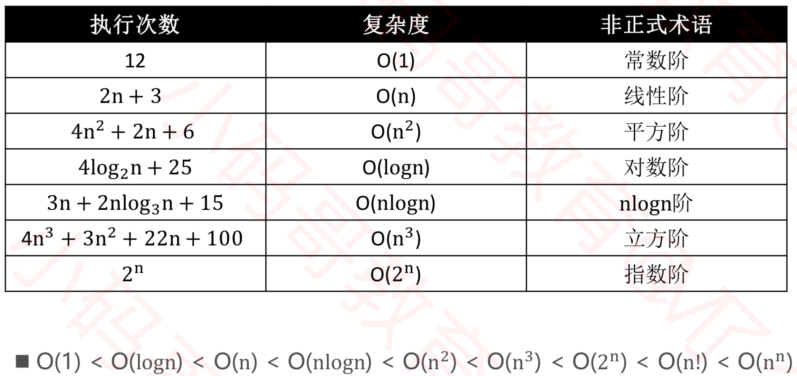

# 数据结构与算法-时间复杂度

### 通过以下纬度评估算法优劣
* 正确性、可读性、健壮性（对不合理输入的反应能力和处理能力）
* **时间复杂度**：估算程序指令的执行次数（执行时间）
* **空间复杂度**：估算所需占用的存储空间

### 大O 表示法描述复杂度，表示的是数据规模 n 对应的复杂度

忽略常熟，系数，低阶

* 9                      ->  O(1)
* 2n + 3                 ->  O(n)
* n^2 + 2n + 6           ->  O(n^2)
* 4n^3 + 3n^2 + n + 100  ->  O(n^3)

对数阶一般省略底数

log2_n = log2_9 * log9_n

**所以log2_n，log9_n 统称为 log_n**

常见的复杂度：


### 菲波那切数列 算法

#### 递归法：O(2^n)

```
public static int fib(int n) {
	if (n <= 1) {
		return n ;
	}
	return fib(n - 1) + fib(n - 2) ;
}
```

#### 遍历法：O(n)

```
public static int fib1(int n) {
	if (n <= 1) {
		return n;
	}
	int first = 0;
	int second = 1;
	for (int i = 0; i < n - 1; i++) {
		int number = first + second;
		first = second;
		second = number;
	}
	return second;
}
```
