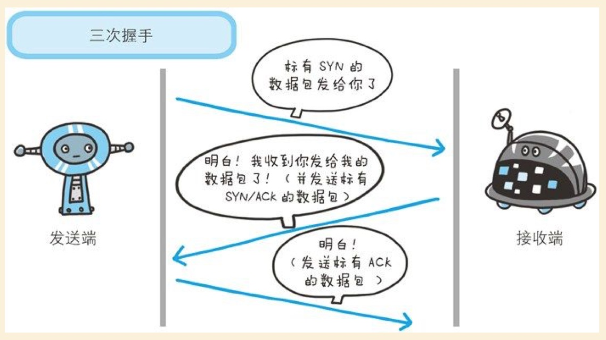
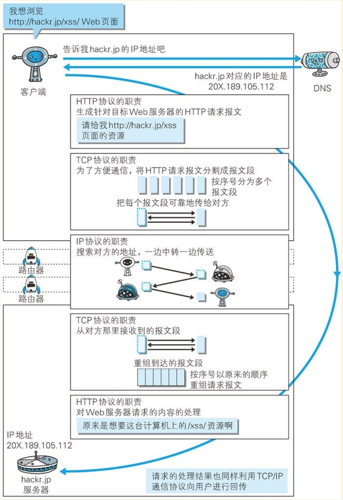
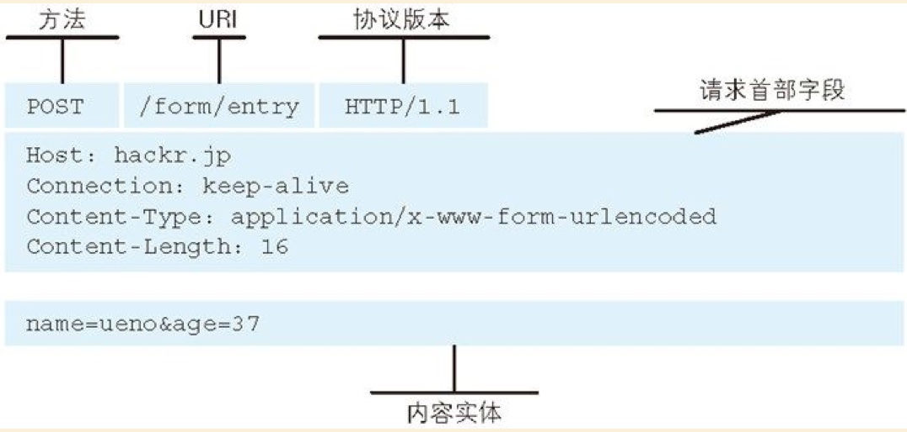

# 《图解HTTP》读书笔记

## 第一章：了解Web及网路基础

### TCP/IP协议
把互联网想关联的协议集合起来总称为TCP/IP协议
TCP/IP 协议族按层次分为：应用层，传输层，网络层，数据链路层

#### 应用层
决定了向用户提供应用服务时通信的活动。
TCP/IP 协议族内预存了各类通用的应用服务，比如：**FTP** 和 **DNS** 服务就是其中两类
**HTTP 协议也处于该层**

#### 传输层
传输层对上层应用层，提供处于网络连接中的两台计算机之间的数据传输。
在传输层有两个性质不同的协议：**TCP**（Transmission Control Protocol，传输控制协议）和 **UDP**（User Data Protocol，用户数据报协议）

#### 网路层（又名网络互联层）
网路层用来处理网络上流动的数据包。数据包是网络传输的最小数据单位，该层规定了通过怎样的路径（所谓的传输路线）到达对方的计算机，并把数据包传送给对方。与对方计算机之间通过多台计算机或网络设备进行传输时，网络层所起的作用就是在众多的选项内选择一条传输路线。

#### 链路层（又名数据链路层，网络接口层）
用来处理连接网络的硬件部分。包括操作系统、硬件的设备驱动、NIC（Network Interface Card，网络适配器，即网卡），及光纤等物理可见部分，硬件上的范畴均在链路层的作用范围之内。

### TCP/IP 通信传输流

利用TCP/IP 协议族进行通信时，会通过分层顺序与对方进行通信，发送端从应用层往下走，接收端则从应用层往上走。
发送端在层与层之间传输数据时，没经过一层时必定会被打上一个该层所属的首部信息，反之，接收端在层与层之间传输数据时，每经过一层时会把对应的首部消去。- 这种把数据信息包装起来的做法称为封装。

### 确保可靠性的 TCP 协议
按层次分，TCP位于传输层，提供可靠的字节流服务（字节流：为了方便传输，将大块数据分割成以报文段为单位的数据包进行管理）。
**TCP 协议为了更容易传送大数据才把数据分割，而且 TCP 协议能够确认数据最终是否送达到对方。**

#### 如何确保数据能到达目标？
TCP 协议采用了三次握手策略。用TCP协议把数据包送出去以后，TCP不会对传送后的情况置之不理，它一定会向对方确认是否成功送达，握手过程使用了TCP的标志：SYN（synchronize）和 ACK（acknowledgement）。
发送端首先先发送一个带SYN标志的数据包给对方，接收端收到后，回传一个带有 SYN/ACK 标志的数据包以示传达确认信息，最后，发送端再回传一个带 ACK 标志的数据包，代表握手结束。若捂手过程中在某个阶段莫名中断，TCP协议会在此以相同的顺序发送相同的数据包



### 负责域名解析的 DNS 服务
DNS（Domain Name System）服务是和HTTP协议一样位于应用层的协议，它提供域名到IP地址之间的解析服务。

浏览一个网址的全过程：

### URL（Uniform Resource Locator，统一资源定位符） 和 URI（统一资源标示符）
URL 是访问web页面需要输入的网页地址
URI 是由某个协议方案表示的资源的定位标示符，协议方案是指访问资源所使用的协议类型名称

URI 用字符串标识某一互联网资源，而URL表示资源的地点（互联网上所处的位置），可见 URL 是 URI 的子集。

## 第二章：简单的HTTP协议

HTTP请求报文由：请求方法、请求URI、协议版本、可选的请求首部字段和内容实体 构成

### HTTP 是一种不保存状态，即无状态协议。
HTTP 协议自身不对请求和响应之间的通信状态进行保存。目的是为了更快的处理大量事务，确保协议的可伸缩性。
后来有一些场景需要保存客户端的状态，比如登录状态，于是引入了 Cookie 技术。有了 Cookie 再用HTTP协议通信，就可以管理状态了。

### 告知服务器意图的HTTP方法
* GET : 获取
* POST: 传输实体主体
* PUT : 传输文件
* HEAD: 获得报文首部
* DELETE: 删除文件
* OPTIONS: 询问支持的方法
* TRACE：追踪路径
* CONNECT：要求用隧道协议连接代理

### 持久连接节省通信量
HTTP 初始版本，每进行一次HTTP通信就要断开一次TCP连接，当年数据小没问题，但随着HTTP的普及，HTTP所传输的内容愈来愈多，每次请求都会造成无谓的TCP连接建立和断开，增加通信量的开销。

为解决上述TCP连接的问题，HTTP/1.1 和 一部分 HTTP/1.0 相处了持久连接的方法，特点是：只要任意一端没有明确的提出断开连接，则保持TCP连接状态。

#### 管线化
持久连接使得多数请求以管线化（pipelining）方式发送成为可能，以前发送请求后需等待并受到响应，才能发送下一个请求。管线化技术出现后，不用等待响应亦可直接发送下一个请求。这样就能做到同时并行发送多个请求。而不需要一个接一个地等待响应了。

## 第三章：HTTP报文内的HTTP信息

