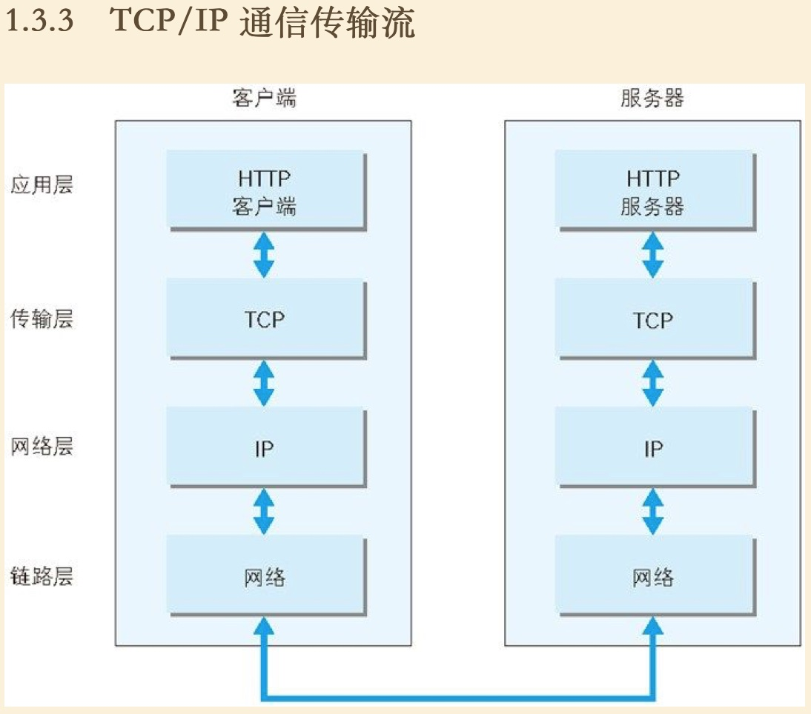

# 《图解HTTP》读书笔记

## 第一章：了解Web及网路基础

### TCP/IP协议
把互联网想关联的协议集合起来总称为TCP/IP协议
TCP/IP 协议族按层次分为：应用层，传输层，网络层，数据链路层

#### 应用层
决定了向用户提供应用服务时通信的活动。
TCP/IP 协议族内预存了各类通用的应用服务，比如：**FTP** 和 **DNS** 服务就是其中两类
**HTTP 协议也处于该层**

#### 传输层
传输层对上层应用层，提供处于网络连接中的两台计算机之间的数据传输。
在传输层有两个性质不同的协议：**TCP**（Transmission Control Protocol，传输控制协议）和 **UDP**（User Data Protocol，用户数据报协议）

#### 网路层（又名网络互联层）
网路层用来处理网络上流动的数据包。数据包是网络传输的最小数据单位，该层规定了通过怎样的路径（所谓的传输路线）到达对方的计算机，并把数据包传送给对方。与对方计算机之间通过多台计算机或网络设备进行传输时，网络层所起的作用就是在众多的选项内选择一条传输路线。

#### 链路层（又名数据链路层，网络接口层）
用来处理连接网络的硬件部分。包括操作系统、硬件的设备驱动、NIC（Network Interface Card，网络适配器，即网卡），及光纤等物理可见部分，硬件上的范畴均在链路层的作用范围之内。

### TCP/IP 通信传输流

利用TCP/IP 协议族进行通信时，会通过分层顺序与对方进行通信，发送端从应用层往下走，接收端则从应用层往上走。
发送端在层与层之间传输数据时，没经过一层时必定会被打上一个该层所属的首部信息，反之，接收端在层与层之间传输数据时，每经过一层时会把对应的首部消去。- 这种把数据信息包装起来的做法称为封装。

